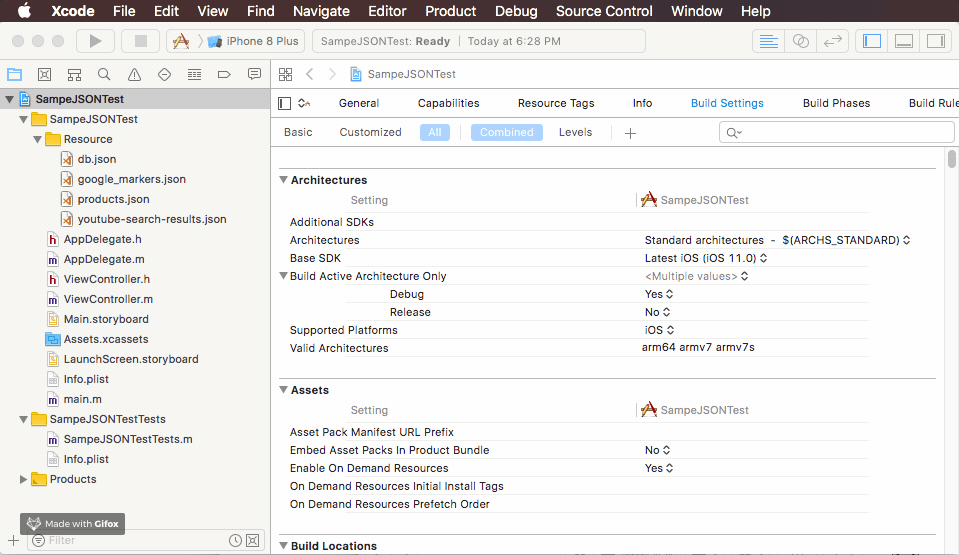

# ARToolChain

A Powerful Command Line &amp; GUI App for Improve Your Develop Working.

## Usage

1. Open a json file whit Xcode
2. Go to `Editor` > `JSONTools` > `Prettity JSON`
3. Done. Enjoy it! 🍺

## Installation

1. Download [ARToolChain.pkg](https://github.com/yanzhiwei147/ARToolChain/releases)(Choose the latest version).
2. Uncompress the download zip, and double click the `ARToolChain.pkg`, according to the instructions install.
3. Open `System Preferences`, location to `Extensions` > `Xcode Source Editor`, ensure the `JSONTools` line was checked.
4. [Optional] Setting Xcode keyboard shortcut: go to `Preferences` > `Key Bindings` -> `Filter: Prettity JSON`, bind your like keyboard shortcut.

## Requirements

- macOS 10.11 or later
- Xcode 8.0 or later